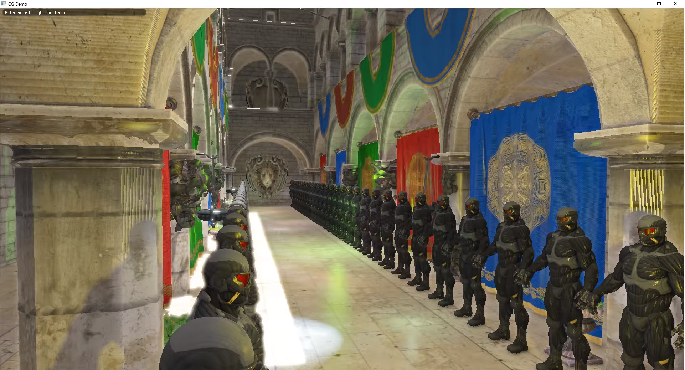

# ChanGameEngine

I started this project as my game engine project, but it became just my experiment. I don't update codes here anymore, because I start to work on my second library.

## 2018.08 ~ 2019.01

I started this project for my portfolio to get a job as game engine / graphics programmer. I studied the math, OpenGL, game physics and so on to make my own game engine. During this period, I implemented the basic graphics and physics parts of the game engine. This is the final scene I made with my engine :

Here is the editing gif of the scene :

you can see the video of this [here](https://youtu.be/KSpS1TO2YgM).

While I was doing this project, I implemented these things:

**Graphics**

* The graphics engine is based on the deferred shading. All of objects in game world will be drawn by the technique.
* PostProcessing : HDR, Bloom, SSAO.
* [Terrain Rendering](https://www.youtube.com/watch?v=gEwG9HVjTYk) with Perlin noise and height map (you can see the terrain rendering and physics

**Light**

* [Editing light properties](https://www.youtube.com/watch?v=0eW7ttd--IM) : Position, Direction, Ambient/Diffuse/Specular Color, Attenuation factors, light radius.
* The types of light : Directional, Point, and Spot light.
* Range Visualizer for each light type
* Shadow cast for each light type
* Editing the shadow frustum for each light type

**Physics**

* Most of physics theories and implementations are based on the "Game Physics Engine Development" Book. This book does not solve a jitter problem caused by its implementation. So it changed my research direction toward Box2D and BulletPhysics Library to learn a valid physics engine implementation. So, I studied the Erin Catto's GDC presentation for Sequential Impulse Constraint Solver and his implementation in [my other repository](https://github.com/lch32111/ChPhysicsEngine/tree/master/ChanPhysicsPlayGround). And the video about it is [here](https://www.youtube.com/watch?v=c333rQkeskM).
* And other codes such as Broad Phase, DynamicAABBtree, Ray Picking are based on Box2D and BulletPhysics Library.
* [Terrain Physics](https://www.youtube.com/watch?v=gEwG9HVjTYk) between terrain triangles and spheres.

## 2020.12 ~ 2021.01

I had stopped this project after I got the job as a game engine programmer. But I have an interest in the high quality rendering, especially using ray tracing. So, I got enough time at this period to study a little of the ray tracing. This is the simple scene I made with the ray tracing :

I Implemented these for this ray-traced scene :

* **Rendering Equation** : I'm using [the Graphics Codex](http://graphicscodex.com/index.php) to learn the rendering equation. And I also refer to the sample code provided with the Graphics Codex in [G3D Innovation Engine](https://casual-effects.com/g3d/www/index.html).
* **Primitive Intersection** : Sphere, Plane, Ray, Line Segment, Triangle. I referred to the [RTCD](https://realtimecollisiondetection.net/) to implement all of the intersections.
* **Bounding Volume Hierarchy** : In order to accelerate the ray intersection, I used the Dynamic AABB Tree, which I implemented by referring to the [box2D](https://github.com/erincatto/box2d) code.

In addition to the above, I used the threads to accelerate the ray tracing by separating the pixels with some threads.

Because I'm using the Graphics Codex to improve my graphics ability, I am going to study BSDF, Path Tracing, Photon Mapping, and so on. Before going deeper on this, I realized that I don't have enough base knowledge on statistics. So I've decided to study it. After that, I can restart this ray tracing work.

